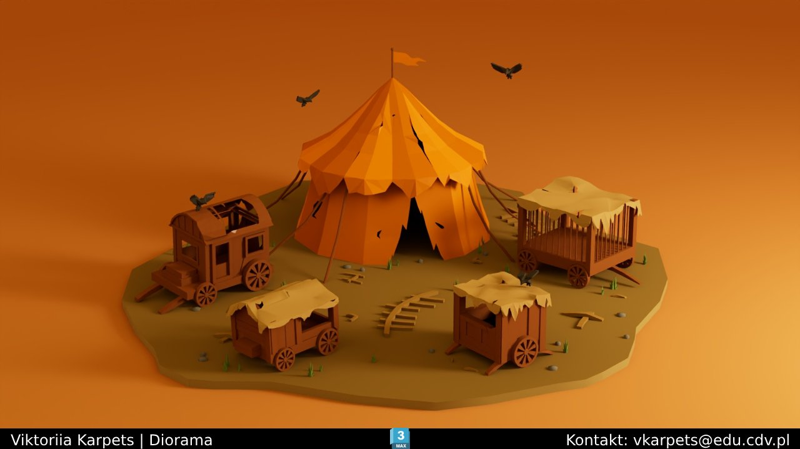
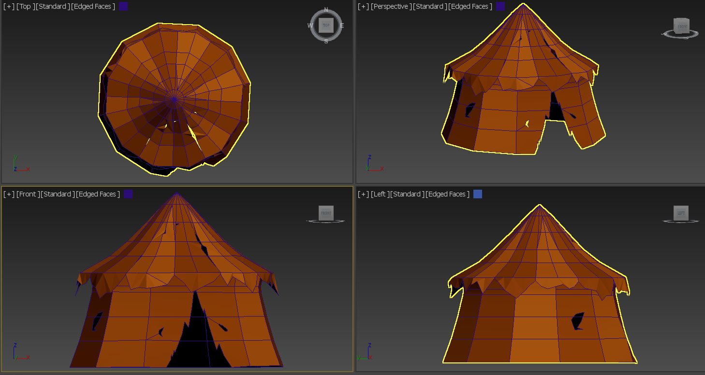
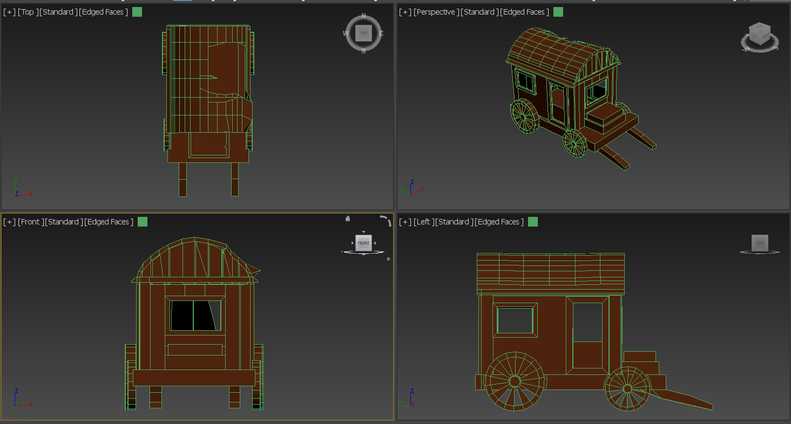
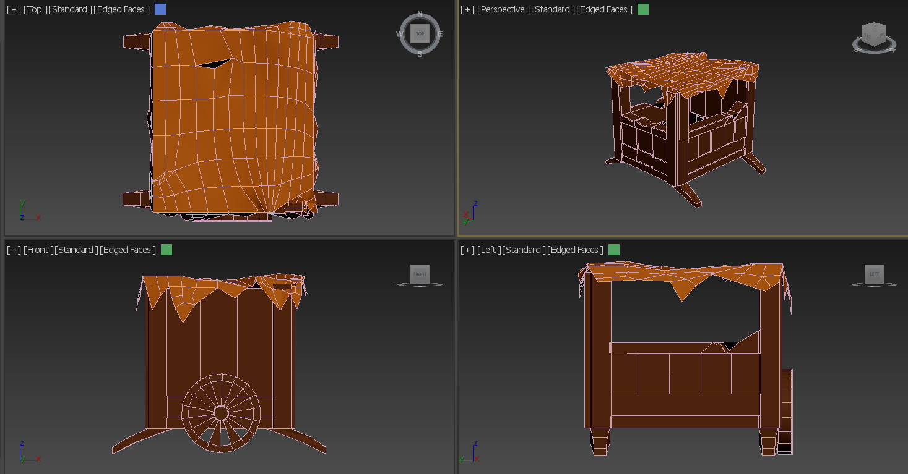
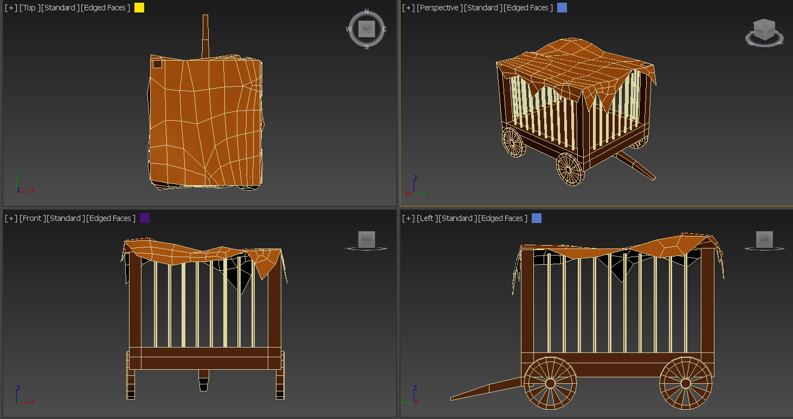
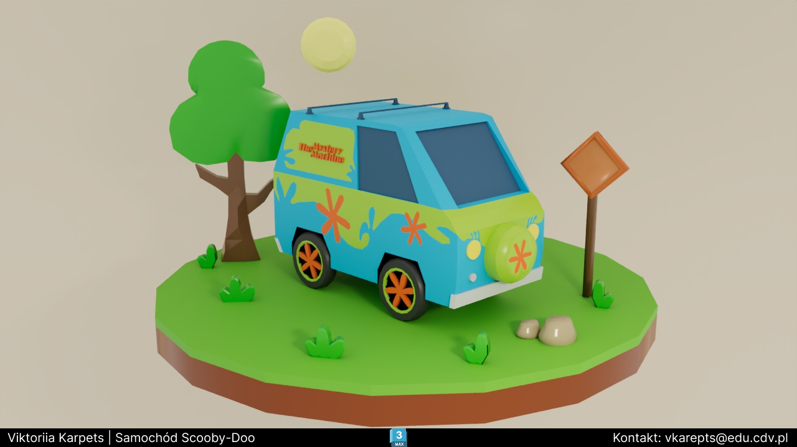
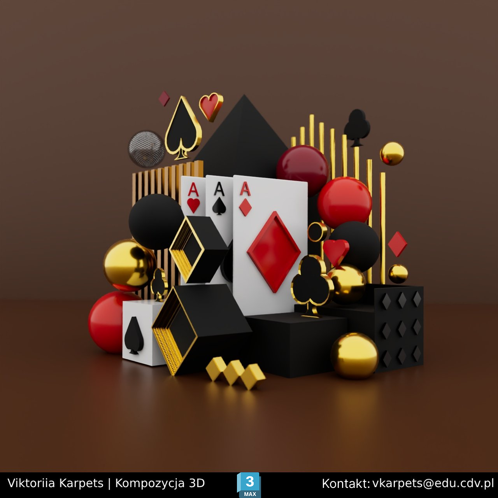
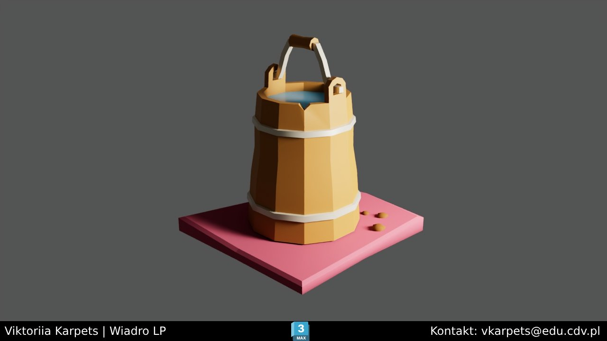

# 3D Art & Game Environment Portfolio 🎨

## 🛠 Tech Stack
* **Software:** Autodesk 3ds Max
* **Specialization:** Stylized Assets & Environment Design
* **Engine:** Unity (basic integration & scene setup)

## 🖼 Key Projects

### 1.  Abandoned Circus Assets
A complex scene featuring multiple unique assets. This project demonstrates my ability to create atmospheric environments and manage multiple assets within a single scene

* **Main Scene:** Includes 4 unique types of circus wagons, environment props, and thematic layout.
* **Technical Details:** All models are integrated into a single coordinate system, ready for game engine import.
* **Source Files:** Full scene available in `.fbx` format in the `/Models` folder.

#### Scene Breakdown (Wireframes & Details):

### 2. The Mystery Machine (Scooby-Doo Fan Art)
A stylized 3D model of the iconic van. Focused on capturing the unique silhouette and vibrant color palette.

### 3. Playing Cards Composition
An artistic experiment inspired by playing cards, created from scratch to practice composition and lighting.

### 4. Prop Modeling (Bucket)
A simple prop exercise focusing on real-world proportions.

---
## 🚀 Skills
* Hard Surface Modeling
* Scene Composition
* Asset optimization for Game Engines

  ## 🛠 Current Experiments & Skill Building
Beyond game assets, I am exploring **Interior Visualization** to improve my understanding of real-world scale and lighting.

* **Apartment Digital Twin:** I am currently working on a personal project — a complete 3D recreation of my own apartment.
* **Focus:** I model every element from scratch (from layout to furniture) to practice architectural accuracy and high-detail asset creation.
